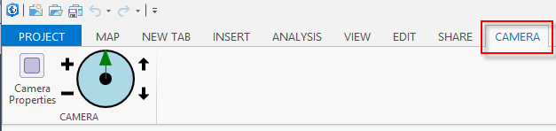

##Lab 1: Navigating the Map View using the Camera

###What you learn in this lab
* How to explore different properties of the camera.
* How to get and set the camera for a map view.
* How to subscribe to mapping events.
* How to create a custom control in the ribbon to navigate the active map view.

*******
* [Step 1: Explore different properties of the camera](#step-1-explore-different-properties-of-the-camera)
* [Step 2: Add behavior to zoom buttons](#step-2-add-behavior-to-zoom-buttons)
* [Step 3: Add behavior to heading slider control](#step-3-add-behavior-to-heading-slider-control)
* [Step 4: Add behavior to pitch buttons](#step-4-add-behavior-to-pitch-buttons)

**Estimated completion time: 30 minutes**
****

####Step 1: Explore different properties of the camera
* Open the Navigate Camera solution in your and build it.
* Launch ArcGIS Pro and create a new blank project using the blank project template.
* A Camera tab will now display in the Ribbon, this was added by the Navigate Camera add-in. Examine the Config.daml. You will notice two buttons on the Pro ribbon. One is defined as a button, the other as a custom control. The custom control also uses MVVM. Notice how the DAML references a view (CameraControl.xaml) for its UI and a view model (CameraControlViewModel.cs for its business logic).

```xml

<customControl id="NavigateCamera_CameraControl" caption="Camera Control" className="CameraControlViewModel" loadOnClick="false" condition="esri_mapping_mapPane">
          <content className="CameraControl" />
        </customControl>
```



* From the Pro Insert tab, Click on "New Map" to add a new map (2D) and then execute "New Scene" from the New Map dropdown menu to add a new scene (3D).
* From the Camera tab click the (custom) Camera Properties button. This will open a new Camera Properties dockpane which will display the properties of the camera.
* Navigate around the 2D and 3D views, notice how the camera properties update on the dockpane
* Now experiment with changing the X or Y value on the dock pane and click the magnifying glass ("zoom to") button. The view should move to that camera position.
* Repeat above with the heading. Notice how this is equivilant to adjusting the rotation.
* Try changing the pitch and compare the difference in 2D vs 3D.
* On the Camera tab, the Custom control currently does nothing. We will implement it in the next steps.

* Click 'Stop Debugging" in Visual Studio

####Step 2: Add behavior to zoom buttons
* In the Navigate Camera "Start" solution open the CameraControlViewModel.cs file uncomment the code in the Zoom Commands region
* As before (in the morning labs) we will be using the Framework class ```RelayCommand``` to implement the ICommands needed for our custom control.
* In the CameraControlViewModel's constructor intialize the _zoomInCmd using the ZoomIn method and the CanZoom method. It would looks something like this:

```c#
  _zoomInCmd = new RelayCommand(() => ZoomIn(), () => CanZoom());
```
* Do the same for _zoomOutCmd but for the Execute delegate pass in ZoomOut.

* Now add logic to CanZoom to return **true** if there is an active map view. This can be determined from the ActiveMapView property on the MappingModule (```MappingModule.ActiveMapView != null;```). Delete the default implementation (```return false;```). 
* Implement the ZoomIn and ZoomOut methods. The MapView instance has two methods ZoomInFixedAsync and ZoomOutFixedAsync that can be used to accomplish this task. Get the active map view from the MappingModule and call the corresponding method for each.
* Open CustomControl.xaml. You must bind the repeating buttons for zoom in and out to the zoom in and out ICommands on the view model. Do you remember how? Hint: look at the xaml you implemented for the "New Bookmark" button in the morning's Lab4.

* Build the solution and launch ArcGIS Pro.
* Test out the behavior of the "Plus" and "Minus" buttons on the Camera tab. Verify that you are able to zoom in and out in both 2D and 3D.
* * The zoom in and out buttons are of type ```RepeatButton``` so you should be able to hold either button down and continuosly adjust the zoom.

####Step 3: Add behavior to heading slider control
* In the Navigate Camera solution open the CameraControlViewModel.cs
* Uncomment the code in the Adjust Heading region
* There are two public properties. IsCameraEnabled is bound to the IsEnabled property of the slider and Heading is bound to the Value property.

```xml
  <Slider Grid.Row="0" ... Value="{Binding Path=HeadingValue, ... IsEnabled="{Binding IsCameraEnabled}" >            

```
* In the CameraControlViewModel's constructor subscribe to the CameraChangedEvents and pass in OnCameraChanged. 
* Subscribe to the ActiveMapViewChangedEvents as well and pass in OnActiveViewChanged.

```C#
//TODO subscribe to CameraChangedEvents and ActiveMapViewChangedEvents.
CameraChangedEvents.Subscribe(OnCameraChanged);
ActiveMapViewChangedEvents.Subscribe(OnActiveViewChanged);
```

* In SetHeadingFromMapView we need to test if the MapView is null. If it is null there is no active map view and we should set the IsCameraEnabled property to false. If it is not null we should get the Camera from the map view and set it to the Camera property on the ViewModel We should then set the IsCameraEnabled property to true and call the private method ```SetHeading()```.

```C#
 private void OnActiveViewChanged(MapViewEventArgs args) {
   SetHeadingFromMapView(args.MapView);
 }
      
private async void SetHeadingFromMapView(MapView mapView) {
   //TODO test if mapView is null.
   //If not null set IsCameraEnabled to true
   //get the Camera from the mapView (mapView.GetCameraAsync())
   //call SetHeading().
   if (mapView != null) {

   }
   else {
      //If null set "IsCameraEnabled = false".
              
   }
}
```
* Look at the code in the SetHeading method. Here we are doing the conversion from the Camera heading of -180 to 180 to the Slider values of 0 to 360. Next we are calling SetProperty (which is a convience method off of the PropertyChangedBase class provided by the framework. Our custom control is bound to ```HeadingValue``` and raising its property notification updates our slider position (i.e. the "arm" of the circle) in response to a change in the heading of the map view camera.
* 
```C#
 private void SetHeading() {
          if (Camera != null) {
              double viewHeading = Camera.Heading < 0 ? 360 + Camera.Heading : Camera.Heading;
              SetProperty(ref _headingValue, viewHeading, () => HeadingValue);
          }
      }
```

* In the setter of the HeadingValue we are converting the value on the slider (or "circle") which ranges from 0 to 360 to a Heading for the Camera which ranges from -180 to 180 and then setting that heading on the local Camera property of the ViewModel.
* Add behavior in the HeadingValue setter to Zoom the active map view to the new Camera (set by the control). Hint: examine  the ZoomToAsync() method of mapview.

```C#

public double HeadingValue {
   get { return _headingValue; }  
   set {
      double cameraHeading = value > 180 ? value - 360 : value; 
      _headingValue = value;
      Camera.Heading = cameraHeading;
      //TODO get the active map view and zoom to the new camera.
   }
}
```

* Finally in the ViewModel constructor we should call SetHeadingFromMapView and pass in the active map view from the MappingModule to initialize the control.

```C#
public CameraControlViewModel() {
    ...
    ...
    //TODO initialize the heading by calling SetHeadingFromMapView() and passing in the active map view.
}
```

* Build the solution and launch ArcGIS Pro. Open your project. If you deleted it or did not save your changes, add a 2D and 3D map and scene respectively to a new blank project.

* Test out the behavior of the heading slider control. Dragging the arrow around the control should rotate the map view. Press the **'V'** key on the keyboard and click and drag in the map view to rotate the view. Verify that the slider updates to reflect the adjusted heading in the view.

####Step 4: Add behavior to pitch buttons
* In the Navigate Camera solution open the CameraControlViewModel.cs
* Uncomment the code in the Pitch Commands region
* Similar to step 2 initialize the RelayCommands for pitch down and pitch up in the ViewModel constructor.

```C#
   _pitchUpCmd = new RelayCommand(() => PitchUp(), () => CanAdjustPitch());
   _pitchDownCmd = ...
```

* In CanAdjustPitch we want to return true if the active map view is not null **and** we are currently working with a 3D view. This is because adjusting pitch has no effect in 2D. Hint: test ```MappingModule.ActiveMapView.ViewMode``` to make sure our mode is not equal to "Map".

```C#

private bool CanAdjustPitch() { 
   // MappingModule.ActiveMapView ...  
}

```
* In PitchUp we will increase our pitch in increments of 5 degrees. Keep incrementing the pitch by 5 degrees until our pitch is greater than or equal to 90 deg. When the camera pitch has been updated zoom the active map view to the new Camera. Hint: ```this.Camera.Pitch += 5;  MappingModule.ActivemapView... ```
* In PitchDown decrement our Camera's pitch until it is less than or equal to -90 degrees. Zoom the active map view to the new camera. Hint: ```Camera.Pitch -= 5; ...```

Open CustomControl.xaml. You must bind the repeating buttons for pitch up and pitch down to the PitchUpCmd and PitchDownCmd ICommannd properties on the view model. Do you remember how? Hint: look at step 2 in this lab.

```XML
<RepeatButton ... x:Name="ForPitchUp" Command="{Binding Path= ... }">
  ...
</RepeatButton>
<RepeatButton ... x:Name="ForPitchDown" Command="{Binding Path= ... }">
  ...
</RepeatButton>
 ```

* Build the solution and launch ArcGIS Pro.

* Test out the behavior of the up and down arrow buttons on the Camera tab. Verify that it adjusts the Pitch in a 3D view. These commands should also disable if you go to a 2D view.
* The pitch up and down buttons are of type ```RepeatButton``` so you should be able to hold either button down and continuosly adjust the pitch.
