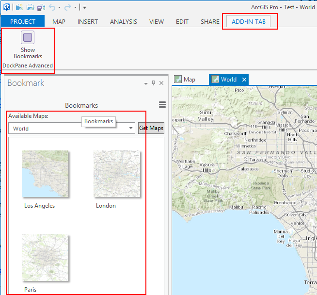

##Lab 4: Advanced DockPane

###What you learn in this lab
* How to Handle project item collection changes
* How to add and delete a bookmark
* How to leverage existing ArcGIS Pro commands
* Add styling to buttons to follow ArcGIS Pro styling guidelines


*******
* [Step 1: Open the DockPane_Advanced Solution](#step-1-open-the-dockpane_advanced-solution)
* [Step 2: Trap for project item collection changes](#step-2-trap-for-project-item-collection-changes)
* [Step 3: Add the ability to delete a bookmark](#step-3-add-the-ability-to-delete-a-bookmark)
* [Step 4: Add the ability to add a new bookmark](#step-4-add-the-ability-to-add-a-new-bookmark)
* [Step 5: Add styling to buttons to follow Pro styles (Bonus)](#step-5-add-styling-to-buttons-to-follow-pro-styles-bonus)

**Estimated completion time: 45 minutes**
****

####Step 1: Open the DockPane_Advanced Solution
* If you haven't already done so please clone arcgis-pro-sdk-preview  
* Navigate in your cloned arcgis-pro-sdk-preview repo to this folder:  
  ..\arcgis-pro-sdk-preview\Workshop\Labs\Labs for Morning\Lab 4\Start  
* Open the start solution called 'DockPane\_Advanced.sln' using VS 2013 and familiarize yourself with the contents.  
* It differs from the Lab 3 exercise in the way that the maps and bookmarks are displayed.  Note also that the bookmarks are displayed in the listview using a data template which displays both the bookmark name and bookmark thumbnail.  
* Open the Bookmark.xaml file and look at the ```BookmarkListItem``` data template.  The data template binds to an object of type ```ArcGIS.Desktop.Mapping.Bookmark``` (that has both Name and Thumbnail properties).  
* Build and run the project using the VS debugger and validate that the map and bookmark list work as expected in ArcGIS Pro:
  
  

* Close ArcGIS Pro to stop the debugger

####Step 2: Trap for project item collection changes. 

* In order to detect when maps are added or removed from the project we first need to subscribe to an event.   Modify the 'InitializeAsync' method to add an 'ArcGISProjectItemsChangedEvent' subscription that calls 'OnProjectCollectionChanged'.

```c#
ArcGISProjectItemsChangedEvents.Subscribe(OnProjectCollectionChanged);
```

The signature for the event delegate is the an implementation has already been coded in your starter solution:  

```c#
private void OnProjectCollectionChanged(ArcGISProjectItemsChangedEventArgs args);
```

* The implementation of this method should modify the ```AllMaps``` collection depending upon whether a project item has been added or removed.  (Hint: check the _args.Action_ parameter to determine if an item is added or removed).  Note that we are only interested in MapProjectItems.  (Hint: check the type of ```args.ProjectItem``` to ensure it is of type ```MapProjectItem``` before adding it to the collection).  

* Since the UI in ArcGIS Pro has to stay responsive, the collection of maps should usually be added to or removed from on a separate thread and not the UI thread.  This means that collections are shared between threads.   This can be accomplished by adding a .Net synchronization helper in the ```InitialiseAsync``` method.  

```c#
BindingOperations.EnableCollectionSynchronization(AllMaps, _lockMapCollection); 
``` 

* Compile and debug the project.  
* Add a new map using the Project window and ensure that the list of maps contains the new map.
* Remove a map using the Project window and verify the list of maps is correct.  

***Review the following:***  

We are now subscribing to ```ArcGISProjectItemsChangedEvents``` which allows us to update our map list dynamically.  We are also updating a collection from a worker thread that is used by the UI thread.  This can be simplemented safely by using the 'BindingOperations.EnableCollectionSynchronization' helper method     

####Step 3: Add the ability to delete a bookmark
* In the Bookmark.xaml file, modify the _BookmarkListItem_ data template to add a button to delete a bookmark.    * A XAML placeholder button called _DeleteButton_ to has already been adde to your start solution's XAML.   
* Uncomment the xaml containing this button.  Review the definition.  Note the way that the ToolTip and Command attributes bind to properties on the viewModel rather than properties on the Bookmark (Note: this is a WPF button we are defining not a Framework button on the ribbon - which uses **_daml_**). 

* Add the _DelBookmarkCommand_ and _DelBookmarkTooltip_ properties to your viewModel. They should both be readonly properties (i.e. they implement only a get).  
- The DelBookmarkTooltip should return the name of the bookmark to be deleted.
- The DelBookmarkCommand should return an ICommand. Follow the ICommand pattern used for the RetrieveMaps command (use RelayCommand as was done in Lab3).  Refer to the method DeleteBookmark as the Execute delegate.  
- The DeleteBookmark method should verify that the mapPath of the selected bookmark can be found (Hint: use the MappingModule.FindMap method to verify if the map exists).  If the map can be found, use the RemoveBookmarkAsync method on the map to remove the bookmark. 

Because our bookmark collection is referencing the map's bookmark collection, our view will automatically update when the map's bookmark collection changes. 

* Compile and test your solution.  Ensure that the list of bookmarks is modified when a bookmark is removed. 

####Step 4: Add the ability to add a new bookmark
In the Bookmark.xaml file we will add a button to the bottom of the dockpane.
- add a fourth rowDefinition to the grid.  Set the height to Auto.
- Add a button element with **gridRow = 3**.  Set the ToolTip and Content attributes to 'New Bookmark'.  Set its horizontal alignment to Right.  We will bind the button's Command property to an ICommand property on the viewModel called **NewBookmarkCommand**.
- Create the ICommand property in BookmarkViewModel.cs. Rather than use the previous RelayCommand pattern, we will leverage the existing ArcGIS Pro command to create a new bookmark. This Pro command has a daml-id of 'esri\_mapping\_CreateBookmark'.  In the NewBookmarkCommand property, use the Utils.GetICommand method to retrieve and return this command.

```C#
private ICommand _newBookmarkCommand;
    public ICommand NewBookmarkCommand
    {
      get
      {
        if (_newBookmarkCommand == null)
          _newBookmarkCommand = Utils.GetICommand("esri_mapping_createBookmark");
        return _newBookmarkCommand;
      }
    }
```

Compile and test your solution.  Ensure that the list of bookmarks is modified when a bookmark is added.

####Step 5: Add styling to buttons to follow Pro styles (Bonus)
ArcGIS Pro has numerous styles available to ensure that custom add-ins look and feel like existing ArcGIS Pro components. In this step we will style the buttons we have added the same as ArcGIS Pro buttons.

In the Bookmark.xaml file, ensure that the new bookmark and GetMap buttons use the _Esri\_SimpleButton_ style. (Hint: use the style attribute on the button and the StaticResource keyword).

Compile and test your solution.  Ensure that the two buttons behave like ArcGIS Pro buttons when you move your mouse over them. 

**Advanced** :  Investigate the Styling-with-ArcGIS-Pro sample (available in the repo under CSharp/Framework) for additional styling options for buttons and other controls. 

